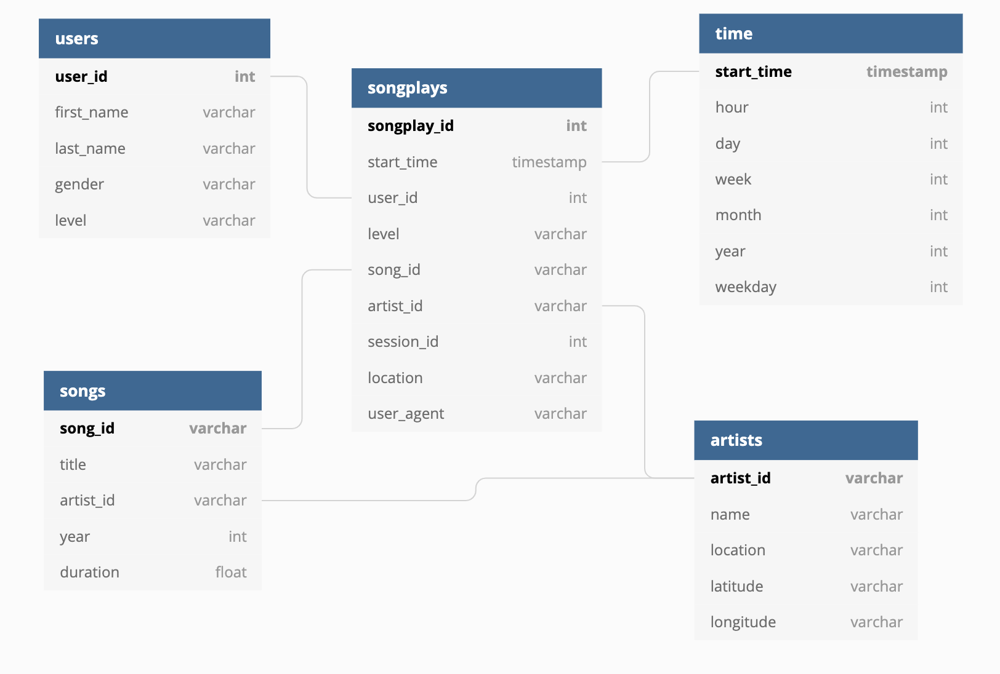

# sparkify

##Dataset

Song Dataset - a subset of real data from the [Million Song](https://labrosa.ee.columbia.edu/millionsong/) Dataset. Each file is in JSON format and contains metadata about a song and the artist of that song. The files are partitioned by the first three letters of each song's track ID. For example, here are filepaths to two files in this dataset.

* Song Dataset - a subset of real data from the [Million Song](https://labrosa.ee.columbia.edu/millionsong/) Dataset. Each file is in JSON format and contains metadata about a song and the artist of that song. The files are partitioned by the first three letters of each song's track ID. For example, here are filepaths to two files in this dataset.

##Database Schema

