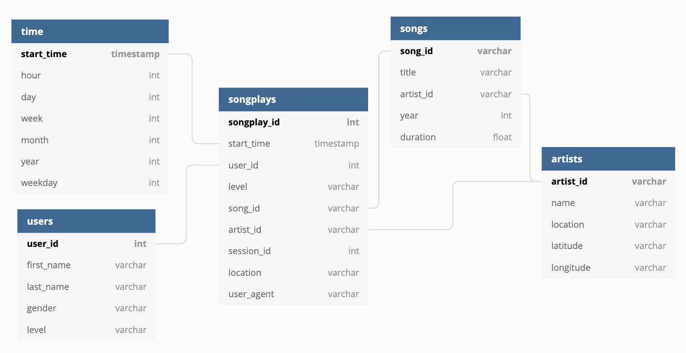

# Sparkify
This Project demonstrate 

## The Dataset
### Song Dataset 
A subset of real data from the [Million Song](https://labrosa.ee.columbia.edu/millionsong/) Dataset. Each file is in JSON format and contains metadata about a song and the artist of that song. The files are partitioned by the first three letters of each song's track ID. For example, here are filepaths to two files in this dataset.

```
song_data/A/B/C/TRABCEI128F424C983.json
song_data/A/A/B/TRAABJL12903CDCF1A.json
```
And below is an example of what a single song file, TRAABJL12903CDCF1A.json, looks like.

```python
{"num_songs": 1, "artist_id": "ARJIE2Y1187B994AB7", "artist_latitude": null, "artist_longitude": null, "artist_location": "", "artist_name": "Line Renaud", "song_id": "SOUPIRU12A6D4FA1E1", "title": "Der Kleine Dompfaff", "duration": 152.92036, "year": 0}
```
### Log Dataset 
This dataset consists of log files in JSON format generated by this [event simulator](https://github.com/Interana/eventsim) based on the songs in the dataset above. These simulate activity logs from a music streaming app based on specified configurations.

The log files in the dataset you'll be working with are partitioned by year and month. For example, here are filepaths to two files in this dataset.

```
log_data/2018/11/2018-11-12-events.json
log_data/2018/11/2018-11-13-events.json
```
And below is an example of what the data in a log file, 2018-11-12-events.json, looks like.


## Database Schema
Using the song and log datasets to create a star schema optimized for queries on song play analysis. This includes the following tables.

### Fact Table
1. songplays - records in log data associated with song plays i.e. records with page `NextSong`
* songplay_id, start_time, user_id, level, song_id, artist_id, session_id, location, user_agent

### Dimension Tables
2. **users** - users in the app
* user_id, first_name, last_name, gender, level
3. **songs** - songs in music database
* song_id, title, artist_id, year, duration
4. **artists** - artists in music database
* artist_id, name, location, latitude, longitude
5. **time** - timestamps of records in songplays broken down into specific units
* start_time, hour, day, week, month, year, weekday



## Project Files

`test.ipynb` displays the first few rows of each table to let you check your database.
`create_tables.py` drops and creates your tables. You run this file to reset your tables before each time you run your ETL scripts.
`etl.ipynb` reads and processes a single file from song_data and log_data and loads the data into your tables. This notebook contains detailed instructions on the ETL process for each of the tables.
`etl.py` reads and processes files from song_data and log_data and loads them into your tables. You can fill this out based on your work in the ETL notebook.
`sql_queries.py` contains all your sql queries, and is imported into the last three files above.